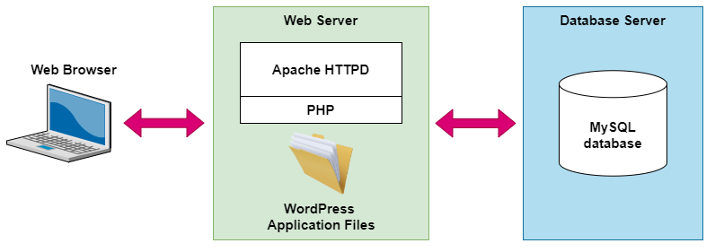
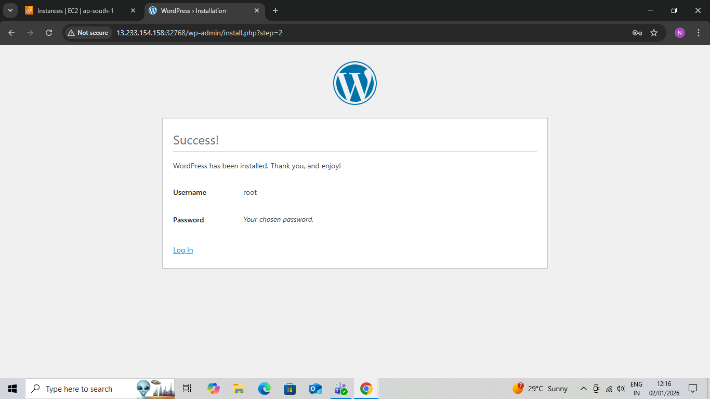
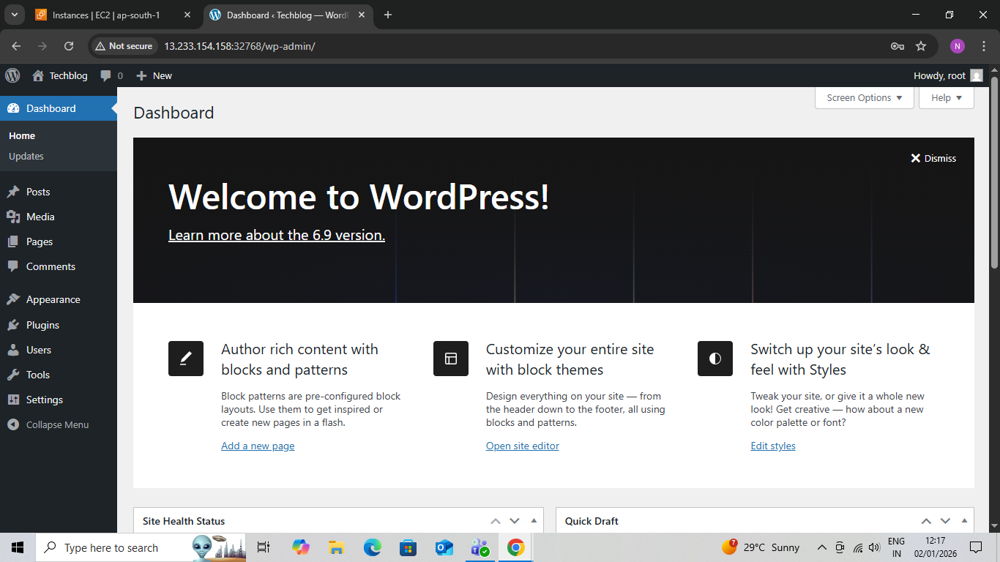
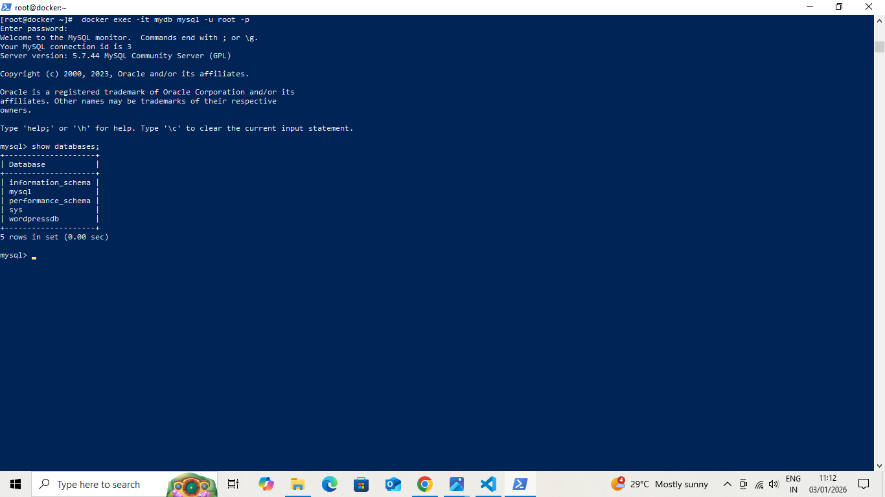

# WordPress  Architecture Deployment on Docker 🐳

A professional DevOps project demonstrating the deployment of a WordPress application using Docker with a MySQL database using a 2-Tier Architecture.

This project highlights containerization, isolation of services, and real-world Docker-based deployment.

---

## Project Overview

This project demonstrates how to deploy a WordPress website using Docker containers.
WordPress runs as the application tier while MySQL runs as the database tier.
Both services run in isolated containers and communicate using Docker networking.

Docker makes the deployment portable, scalable, and easy to manage.

---

## Architecture Diagram



---

## Architecture Type

2-Tier Architecture

Tier 1 – Application Tier: WordPress  
Tier 2 – Database Tier: MySQL  

---

## Technologies Used

Docker  
Docker Hub Images  
Linux / Ubuntu  
WordPress  
MySQL  
Web Browser  


## Prerequisites

Docker installed and running  
Basic Docker and WordPress knowledge  
Linux system or Cloud VM (EC2)  

---

## Steps to Deploy WordPress Using Docker

### Step 1: Launch an EC2 Instance  
Launch a Linux/(Ubuntu) EC2 instance and connect using SSH.

### Step 2: Install Docker  
```
sudo apt update  
sudo apt install docker -y  
sudo systemctl start docker  
sudo systemctl enable docker

```

Verify Docker installation:
```  
docker --version 
```

### Step 3: Pull Required Docker Images  

docker pull mysql:5.7  
docker pull wordpress  

### Step 4: Create MySQL Container  
```
docker run -d  
--name mydb  
-e MYSQL_ROOT_PASSWORD=root  
-e MYSQL_DATABASE=wordpressdb  
mysql:5.7  
```

### Step 5: Create WordPress Container  
```
docker run -d -p 80:80  
--name wordpressapp  
-e WORDPRESS_DB_HOST=mydb  
-e WORDPRESS_DB_USER=root  
-e WORDPRESS_DB_PASSWORD=root  
-e WORDPRESS_DB_NAME=wordpressdb  
--link mydb:mysql  
wordpress  
```


## Command Explanation
```
-p 80:80 exposes WordPress on the browser  
WORDPRESS_DB_HOST specifies the MySQL container name  
--link connects the WordPress container to the MySQL container  
```

## Access WordPress in Browser

Open your browser and visit  
```
http://<SERVER-IP>:80  
```


## Project Screenshots

### WordPress Installation Page  


### WordPress Admin Dashboard  



### MySQL Database Verification

---

## Verify Running Containers
```
docker ps  
```
---

## Execute Commands Inside Container
```
docker exec -it <container_id> /bin/bash  

Access MySQL  

mysql -u root -p  
```

## Environment Variables Explanation

WORDPRESS_DB_HOST – MySQL container name  
WORDPRESS_DB_USER – Database username  
WORDPRESS_DB_PASSWORD – Database password  
WORDPRESS_DB_NAME – Database name  

---

## Advantages of Using Docker for WordPress

Easy and fast setup  
Platform independent  
Isolated application environment  
Scalable architecture  
Beginner-friendly DevOps project  

---

## Key Learnings

Docker container creation  
Multi-container application deployment  
WordPress and MySQL integration  
2-Tier architecture implementation  
Real-world DevOps workflow  

---

## Conclusion

This project demonstrates a complete 2-Tier WordPress Architecture using Docker where application and database layers are isolated for better scalability and manageability.

It is ideal for DevOps beginners, cloud learners, and interview preparation.

---

## Author

Neha Pawar  

---

